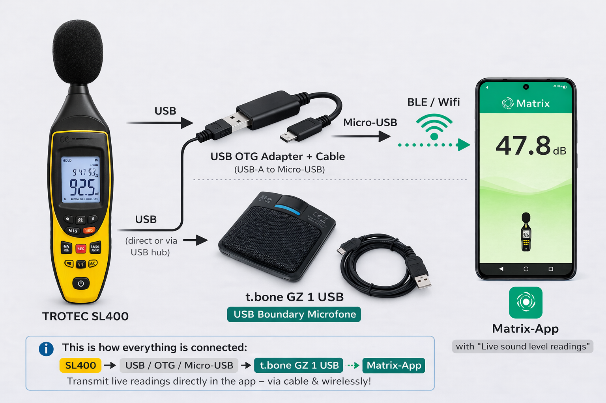
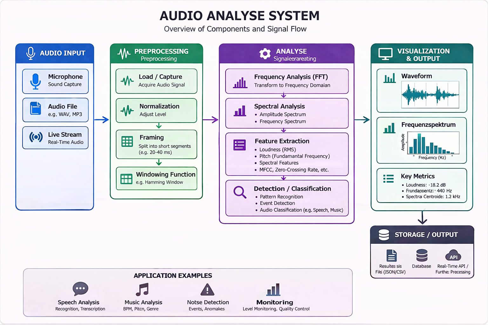
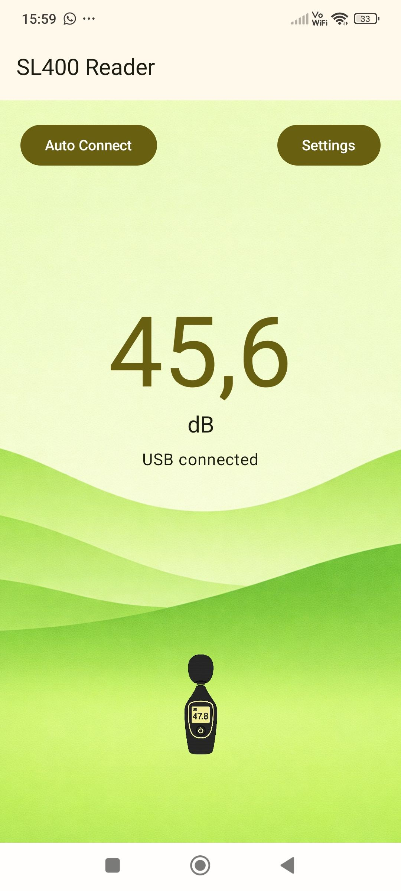
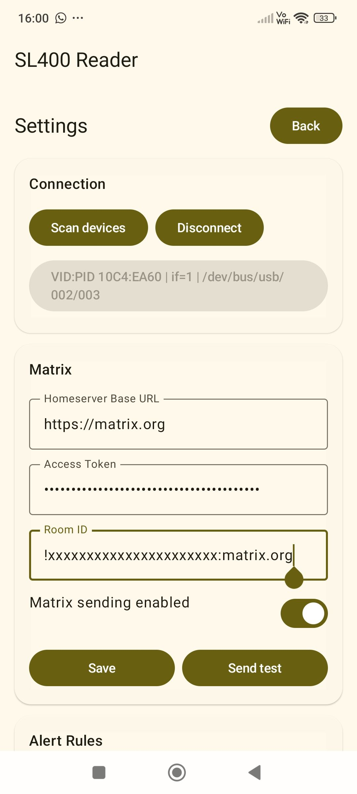
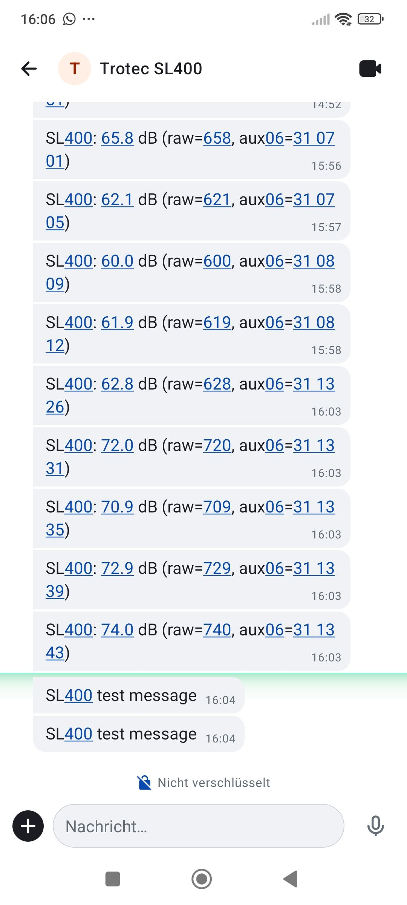

# Trotec SL400 Reader for Android



An Android application for reading measurements from a **Trotec SL400** sound level meter over **USB OTG / USB serial**, displaying live sound values in a custom mobile UI, capturing incident audio, and optionally forwarding alerts and remote-control commands through **Matrix**.

This project now combines five main areas:

* **USB serial communication** with the SL400
* **Reverse-engineered protocol decoding** for measurement frames
* **Acoustic metrics and alert evaluation**
* **Incident audio buffering and clip upload**
* **Matrix integration** for messaging, alerting, clip delivery, and remote control

---

## Table of Contents

* [Overview](#overview)
* [Current Features](#current-features)
* [Project Status](#project-status)
* [Architecture Overview](#architecture-overview)
* [How It Works](#how-it-works)

  * [USB / Serial Communication](#usb--serial-communication)
  * [SL400 Protocol Decoding](#sl400-protocol-decoding)
  * [Samples and Measurement Model](#samples-and-measurement-model)
  * [Acoustic Metrics Engine](#acoustic-metrics-engine)
  * [Alarm Evaluation](#alarm-evaluation)
  * [Incident Storage and Retention](#incident-storage-and-retention)
  * [Audio Capture and Incident Clips](#audio-capture-and-incident-clips)
  * [Matrix Integration](#matrix-integration)
  * [Background Service](#background-service)
* [User Interface](#user-interface)
* [Matrix Commands](#matrix-commands)
* [Configuration](#configuration)

  * [Matrix Settings](#matrix-settings)
  * [Alert Settings](#alert-settings)
  * [Allowed Senders](#allowed-senders)
* [Project Structure](#project-structure)
* [Requirements](#requirements)
* [Permissions and Android Manifest Notes](#permissions-and-android-manifest-notes)
* [Build and Run](#build-and-run)
* [Troubleshooting](#troubleshooting)
* [Known Limitations](#known-limitations)
* [Roadmap Ideas](#roadmap-ideas)
* [Disclaimer](#disclaimer)
* [License](#license)

---

## Overview

The goal of this app is to turn an Android device into a mobile field companion for the **Trotec SL400**.

The app can:

* detect compatible USB serial devices
* connect to the SL400 over USB OTG
* continuously read and decode measurements
* show the latest sound level in dB
* compute rolling acoustic metrics such as **LAeq 1 min / 5 min / 15 min** and **max 1 min**
* evaluate configurable alert rules
* capture buffered audio clips around incidents
* store and manage incident history locally
* send alert messages and audio clips to Matrix rooms
* receive remote commands from a Matrix room to update alert behavior, query incidents, and fetch clips

The UI is optimized around a simple live measurement screen and a separate settings area for configuration and diagnostics.

---

## Current Features

### USB / Device Features

* USB OTG based device connection
* detection of compatible USB serial devices using `usb-serial-for-android`
* explicit USB permission handling through `UsbManager`
* automatic device refresh on attach / detach
* connect / disconnect support
* foreground service while measurement is active

### Measurement Features

* marker-based protocol parsing
* live decoding of SL400 frames
* extraction of measurement values and auxiliary bytes
* recent measurement history in the UI
* rolling acoustic metrics over multiple time windows

### Acoustic Metrics Features

* current live value
* **LAeq 1 minute**
* **LAeq 5 minutes**
* **LAeq 15 minutes**
* **max 1 minute**
* time-above-threshold tracking for the last minute
* window coverage tracking so alerts do not trigger before enough data exists

### Alert Features

* configurable threshold in dB
* hysteresis support to avoid noisy re-triggering
* threshold crossing or periodic alert modes
* selectable trigger metric
* target room override for alert delivery
* persisted alert configuration with DataStore

### Audio / Incident Features

* continuous audio ring buffer for incident capture
* configurable pre-roll and post-roll clip creation in code
* local WAV clip generation
* automatic audio hint analysis with confidence, source hints, and quality flags (sub/bass/mid/high ratios, low-end pulse detection, clipping/DC/low-signal checks)
* local JSONL-based incident store
* retention cleanup for old incidents and clips
* reuse of already uploaded Matrix media URLs when possible

### Matrix Features

* send Matrix test messages
* send alert messages to a Matrix room
* sync a Matrix command room
* ignore the app's own Matrix user during sync
* persist Matrix sync token across sessions
* modular Matrix command handling
* remote alert configuration via Matrix chat commands
* incident list queries by time window
* summary queries
* JSON export of incident data
* on-demand graphs (PNG)
* daily report scheduler (summary + optional JSON + optional graph)
* audio buffer remote control
* clip upload on demand
* audio hint follow-up messages with confidence and source hints

### UI Features

* custom themed live measurement screen
* settings screen with separate Matrix and alert sections
* USB audio test screen
* alarm audio buffer screen
* custom background and device imagery
* recent sample preview list with a bounded history

---

## Project Status

This project is based on a **partially reverse-engineered** protocol.

What is already working well:

* USB serial connection
* measurement frame parsing
* live value display
* rolling acoustic metrics
* alarm evaluation logic
* Matrix alert sending
* Matrix command sync and parsing
* incident storage
* incident clip generation and upload
* persistent settings with DataStore

What is still evolving:

* protocol documentation for all tags
* UI polish and information architecture
* clip metadata enrichment such as duration and waveform previews
* more advanced graphs and history views
* more robust background behavior on all Android / USB combinations
* broader hardware testing for USB microphones and hubs

---

## Architecture Overview

At a high level, the app works like this:

1. **`Sl400Repository`** reads raw serial data from the device.
2. **`Sl400Decoder`** converts tagged byte frames into `Sl400Sample` objects.
3. **`AcousticMetricsEngine`** builds rolling metrics from the live sample stream.
4. **`AlarmEvaluator`** decides whether an alert should be fired based on the selected metric mode and alert settings.
5. **`IncidentRepository`** stores the incident, while **`AlarmAudioCaptureCoordinator`** creates a buffered WAV clip.
6. **`HttpMatrixPublisher`** sends alert messages and optional audio clips to Matrix.
7. **`MatrixSyncClient`** listens for commands from the configured Matrix command room.
8. **`MatrixCommandProcessor`** and its command handlers interpret remote commands and apply changes or queries.

The orchestration happens in **`Sl400ViewModel`**.

---

## How It Works

## USB / Serial Communication

The app uses Android's USB host APIs together with the `usb-serial-for-android` library.

Serial parameters currently used:

* **Baud rate:** `9600`
* **Data bits:** `8`
* **Parity:** `NONE`
* **Stop bits:** `1`
* **Flow control:** `NONE`
* **DTR:** `false`
* **RTS:** `false`

Device discovery happens via `UsbSerialProber.getDefaultProber().findAllDrivers(...)`.

When a user selects a device:

1. the app checks USB permission
2. Android permission is requested if needed
3. the first available serial port is opened
4. serial parameters are applied
5. a read loop starts in a coroutine on `Dispatchers.IO`

Main class:

* `sl400/Sl400Repository.kt`

---

## SL400 Protocol Decoding

The protocol is currently interpreted as a tagged byte stream with `0xA5` as a marker byte.

The decoder works as a small state machine:

* `SEEK_MARKER`
* `READ_TAG`
* `READ_PAYLOAD`

Known tags currently handled:

* `0x0D` → measurement payload
* `0x06` → auxiliary 3-byte payload
* `0x00` → sample end / sample emit trigger
* additional observed tags with fixed lengths are recognized but not yet semantically decoded

Measurement decoding currently uses a packed BCD-like interpretation:

* hundreds from low nibble of byte 1
* tens / ones from byte 2
* final value is represented as tenths of dB

Example:

* raw tenths `478` → `47.8 dB`

Main decoder:

* `sl400/Sl400Decoder.kt`

---

## Samples and Measurement Model

Each complete sample is represented as:

```kotlin
data class Sl400Sample(
    val timestampMs: Long,
    val db: Double,
    val rawTenths: Int,
    val aux06Hex: String?,
    val tags: List<Int>
)
```

This gives the app both:

* a user-friendly value (`db`)
* a raw machine-friendly value (`rawTenths`)
* optional auxiliary payload data
* the seen tag list for debugging / analysis

The most recent samples are exposed through a `SharedFlow` in the repository and collected in the `Sl400ViewModel`.

---

## Acoustic Metrics Engine

Rolling metrics are computed by:

* `sl400/AcousticMetrics.kt`
* `sl400/AcousticMetricsEngine.kt`

The engine keeps a sliding in-memory sample window and computes:

* `currentDb`
* `laEq1Min`
* `laEq5Min`
* `laEq15Min`
* `maxDb1Min`
* `timeAboveThresholdMs1Min`
* `coverage1MinMs`
* `coverage5MinMs`
* `coverage15MinMs`

### Why coverage matters

LAeq-based alerts should not trigger before enough data exists.

For example:

* `LAEQ_1_MIN` requires at least 60 seconds of valid coverage
* `LAEQ_5_MIN` requires at least 5 minutes of valid coverage
* `LAEQ_15_MIN` requires at least 15 minutes of valid coverage

This logic prevents false early triggers when the app has only recently started collecting measurements.

### Metric modes available for alerting

```kotlin
enum class MetricMode {
    LIVE,
    LAEQ_1_MIN,
    LAEQ_5_MIN,
    LAEQ_15_MIN,
    MAX_1_MIN
}
```

---

## Alarm Evaluation

Alert behavior is handled by:

* `alert/AlertConfig.kt`
* `alert/AlarmEvaluator.kt`

### Supported alert settings

* `enabled`
* `thresholdDb`
* `hysteresisDb`
* `minSendIntervalMs`
* `sendMode`
* `metricMode`
* `allowedSenders`
* `commandRoomId`
* `targetRoomId`
* `alertHintFollowupEnabled`
* `dailyReportEnabled`
* `dailyReportHour`
* `dailyReportMinute`
* `dailyReportRoomId`
* `dailyReportJsonEnabled`
* `dailyReportGraphEnabled`

### Alert modes

#### `CROSSING_ONLY`

Sends an alert only when the selected metric crosses the threshold from below.

#### `PERIODIC_WHILE_ABOVE`

Sends an alert when crossing the threshold and then continues sending periodically while the selected metric remains above the threshold and the minimum interval has elapsed.

### Hysteresis behavior

Hysteresis prevents repeated re-triggering around the threshold.

Example:

* threshold = `70.0`
* hysteresis = `2.0`

The system triggers above `70.0` and only resets once the selected metric falls to `68.0` or below.

### Alert timing and audio hints

When incident audio capture is enabled, alerts are delayed briefly so the audio hint can be included.
If the hint is not ready within a short timeout, the alert is sent without it.
Optionally, a follow-up hint message can be sent depending on `alertHintFollowupEnabled`.

Example audio hint message:

```text
SL400 audio hint (id=...): bass-heavy music (0.79), likely stage / PA dominated (clipped)
```

---

## Incident Storage and Retention

Incident persistence is handled by:

* `incident/IncidentRecord.kt`
* `incident/IncidentRepository.kt`

Incidents are stored locally in:

* `filesDir/incidents/incidents.jsonl`

Each incident stores:

* incident ID
* timestamp
* room ID
* metric mode and metric value
* threshold at trigger time
* rolling acoustic metrics
* time above threshold for the last minute
* local clip path
* upload state
* Matrix content URI (`mxcUrl`) if already uploaded
* optional audio hint field

### Cleanup behavior

The repository can automatically:

* remove incidents older than a configured retention window
* limit the total number of incident records
* limit the total number of stored clips
* delete unreferenced clip files after cleanup

Current cleanup call in the view model keeps:

* up to **14 days** of incident history
* up to **2000 records**
* up to **200 clips**

---

## Audio Capture and Incident Clips

Incident audio buffering is handled by:

* `audio/AlarmAudioCaptureCoordinator.kt`
* `audio/AudioRingBuffer.kt`
* `audio/WavWriter.kt`

### What it does

The app can keep an in-memory ring buffer of microphone audio so that when an alert fires, it captures a clip containing audio from **before and after** the incident.

Current defaults in code:

* ring buffer: `30 seconds`
* pre-roll: `10 seconds`
* post-roll: `20 seconds`

### Audio sources

The app tries to pick a preferred input device in this order:

1. USB device
2. USB headset
3. first available input

### Audio controls currently available

* local start/stop of the alarm audio buffer in the UI
* remote Matrix commands for `audio start`, `audio stop`, and `audio status`
* local USB microphone test recording via `AudioTestRecorder`

### Audio hint analysis

Audio hints are computed from incident clips and include label, confidence, source hint, and quality flags (clipped input, DC offset, low signal). Hints can be computed from WAV files or directly from PCM:

```kotlin
AudioHintAnalyzer.analyzeWav(file)
AudioHintAnalyzer.analyzePcm16(pcmData, sampleRate, channels)
```



### Output format

Incident clips are written as **WAV / PCM 16-bit** files.

Example file location:

* `filesDir/audio_incidents/incident_<id>_<timestamp>.wav`

### Concurrency guard

The audio coordinator uses an `isCapturing` flag so multiple incident captures do not overlap.

---

## Matrix Integration

Matrix support is implemented as a lightweight client integration.

Main files:

* `matrix/MatrixConfig.kt`
* `matrix/MatrixSettingsRepository.kt`
* `matrix/HttpMatrixPublisher.kt`
* `matrix/MatrixSyncClient.kt`
* `alert/MatrixCommandProcessor.kt`
* `alert/MatrixConfigCommandHandler.kt`
* `alert/MatrixAudioCommandHandler.kt`
* `alert/MatrixQueryCommandHandler.kt`
* `alert/MatrixClipCommandHandler.kt`
* `alert/MatrixExportCommandHandler.kt`
* `alert/MatrixReportCommandHandler.kt`
* `alert/MatrixGraphCommandHandler.kt`
* `alert/MatrixHelpCommandHandler.kt`

### Sending

The app can send:

* plain Matrix test messages
* alert messages
* text responses to Matrix commands
* audio clips as `m.audio`
* files (JSON) as `m.file`
* graphs (PNG) as `m.image`
* already-uploaded audio again using a stored `mxc://` URL without re-uploading

### Sync

The app can sync a command room using `/sync` and:

* persist the `next_batch` token
* ignore events coming from its own Matrix account
* parse chat commands
* update alert settings from received commands
* answer queries with text summaries
* upload or resend clips

### Remote control model

The app listens for commands in a configured `commandRoomId` and uses `allowedSenders` to restrict which Matrix users are allowed to control the device.

### Daily reports

Daily reports are scheduled via `WorkManager` and can send:

* a summary message
* an optional JSON export
* an optional incident graph (PNG)

---

## Background Service

When the app successfully connects to the SL400, it starts a foreground service:

* `Sl400ForegroundService.kt`

This service exists to support background measurement operation and keep the app alive while the USB connection is active.

It creates a low-importance notification channel and runs with:

* foreground notification
* `FOREGROUND_SERVICE_TYPE_CONNECTED_DEVICE`

This is important for newer Android versions.

---

## User Interface

The app currently has two main UI modes plus additional settings cards.

### 1. Home Screen



A simplified live measurement screen with:

* large current dB value
* USB connection status
* background artwork
* device illustration
* quick actions for auto-connect and opening settings

### 2. Settings Screen



Structured into cards for:

* USB / connection handling
* Matrix configuration
* alert configuration
* USB microphone test
* alarm audio buffer
* recent samples

### 3. Matrix / Remote Control View



The Matrix integration lets you:

* configure alerts remotely
* start / stop audio buffering remotely
* request incident lists
* request summaries
* request clips

UI is written with **Jetpack Compose** and themed via:

* `ui/theme/Color.kt`
* `ui/theme/Theme.kt`
* `ui/theme/Type.kt`

---

## Matrix Commands

The app currently supports the following Matrix chat commands in the configured command room:

```text
!sl400 help
!sl400 status
!sl400 config
!sl400 set enable true|false
!sl400 set threshold 72.5
!sl400 set hysteresis 2.0
!sl400 set interval 30000
!sl400 set mode crossing|periodic
!sl400 set metric live|laeq1|laeq5|laeq15|max1
!sl400 set commandroom !abc123:server.tld
!sl400 set targetroom !xyz456:server.tld
!sl400 allow @user:server.tld
!sl400 deny @user:server.tld
!sl400 set dailyreport true|false
!sl400 set reporttime 08:30
!sl400 set reportroom !report:server.tld
!sl400 set reportjson true|false
!sl400 set reportgraph true|false
!sl400 set alerthint true|false
!sl400 audio start
!sl400 audio stop
!sl400 audio status
!sl400 incidents since 30m
!sl400 incidents between 2026-03-27T18:00 2026-03-27T23:00
!sl400 incidents today
!sl400 incidents yesterday
!sl400 clips since 2h
!sl400 clip last
!sl400 clip incident <incidentId>
!sl400 summary since 1h
!sl400 summary today
!sl400 summary yesterday
!sl400 json today
!sl400 json yesterday
!sl400 json since 24h
!sl400 json since 24h cliponly
!sl400 json since 24h metric=laeq5
!sl400 report now
!sl400 report today
!sl400 report yesterday
!sl400 report since 24h
!sl400 graph today
!sl400 graph yesterday
!sl400 graph since 6h
```

### Command behavior

* `status` returns the current alert configuration
* `set ...` updates alert and report configuration
* `commandroom` changes the command room ID
* `targetroom` changes the destination room for alerts
* `allow` adds a Matrix user to the allowed sender list
* `deny` removes a Matrix user from the allowed sender list
* `audio ...` controls or queries the audio ring buffer
* `incidents ...` returns incident lists for a requested time range
* `clips ...` returns available clip information
* `clip ...` uploads the latest or a specific incident clip
* `summary ...` returns a compact aggregated incident summary
* `json ...` returns a JSON export of incidents as a file upload
* `report ...` returns a summary and (optionally) JSON/graph based on report settings
* `graph ...` returns a PNG graph of incidents

---

## Configuration

## Matrix Settings

The following settings are stored using DataStore:

* `homeserverBaseUrl`
* `accessToken`
* `roomId`
* `enabled`
* `syncToken`

These are managed in:

* `matrix/MatrixSettingsRepository.kt`

### Notes

* `roomId` should be the Matrix room ID used for test messages or as a default target room
* HTTPS should be used for the homeserver URL
* access tokens should be treated as sensitive credentials

---

## Alert Settings

The following settings are persisted using DataStore:

* alert enabled / disabled
* threshold
* hysteresis
* minimum interval
* send mode
* metric mode
* command room ID
* target room ID
* alert hint follow-up enabled
* daily report enabled
* daily report time
* daily report room override
* daily report JSON enabled
* daily report graph enabled
* allowed senders CSV

These are managed in:

* `alert/AlertSettingsRepository.kt`

---

## Allowed Senders

`Allowed Senders` is a comma-separated list of full Matrix user IDs that are allowed to send configuration commands.

Example:

```text
@alice:example.org,@bob:example.org
```

If the list is empty, any sender in the configured command room can issue commands.

Recommended production setup:

* use a dedicated command room
* allow only specific user IDs
* keep the command room separate from the alert room
* use a dedicated Matrix bot account or app account for SL400 control

---

## Project Structure

```text
app/src/main/java/de/drremote/trotecsl400/
├── MainActivity.kt
├── Sl400ForegroundService.kt
├── UsbDeviceExtensions.kt
├── alert/
│   ├── AlarmEvaluator.kt
│   ├── AlertConfig.kt
│   ├── AlertSettingsRepository.kt
│   ├── JsonExporter.kt
│   ├── DailyReportScheduler.kt
│   ├── DailyReportWorker.kt
│   ├── IncidentGraphRenderer.kt
│   ├── MatrixAudioCommandHandler.kt
│   ├── MatrixClipCommandHandler.kt
│   ├── MatrixCommandHandler.kt
│   ├── MatrixCommandParsing.kt
│   ├── MatrixCommandProcessor.kt
│   ├── MatrixCommandTypes.kt
│   ├── MatrixConfigCommandHandler.kt
│   ├── MatrixExportCommandHandler.kt
│   ├── MatrixGraphCommandHandler.kt
│   ├── MatrixHelpCommandHandler.kt
│   ├── MatrixQueryCommandHandler.kt
│   ├── MatrixReportCommandHandler.kt
│   └── SummaryFormatter.kt
├── audio/
│   ├── AlarmAudioCaptureCoordinator.kt
│   ├── AudioHintAnalyzer.kt
│   ├── AudioInputDeviceSelector.kt
│   ├── AudioRingBuffer.kt
│   ├── AudioTestRecorder.kt
│   └── WavWriter.kt
├── incident/
│   ├── IncidentRecord.kt
│   └── IncidentRepository.kt
├── matrix/
│   ├── HttpMatrixPublisher.kt
│   ├── MatrixConfig.kt
│   ├── MatrixPublisher.kt
│   ├── MatrixSettingsRepository.kt
│   ├── MatrixSyncClient.kt
│   └── MxcUploadResult.kt
├── sl400/
│   ├── AcousticMetrics.kt
│   ├── AcousticMetricsEngine.kt
│   ├── Sl400Decoder.kt
│   ├── Sl400Repository.kt
│   ├── Sl400Sample.kt
│   └── Sl400ViewModel.kt
└── ui/
    ├── cards/
    │   ├── AlarmAudioCard.kt
    │   ├── AlarmCard.kt
    │   ├── AudioTestCard.kt
    │   ├── CardShape.kt
    │   ├── ConnectionCard.kt
    │   ├── MatrixCard.kt
    │   ├── RecentSamplesCard.kt
    │   └── StatusCard.kt
    ├── screens/
    │   ├── HomeScreen.kt
    │   └── SettingsScreen.kt
    └── theme/
        ├── Color.kt
        ├── Theme.kt
        └── Type.kt
```

Additional UI image resources are expected under `res/drawable`, for example:

* `sl400_bg`
* `sl400_meter`
* `sl400_mock`

---

## Requirements

### Hardware

* Android phone or tablet with **USB OTG** support
* Trotec SL400
* appropriate USB OTG adapter / cable
* optional USB microphone for audio capture

### Software

* Android Studio
* Kotlin
* Gradle
* Android SDK compatible with Jetpack Compose

### Network

* Internet access for Matrix features
* reachable Matrix homeserver over HTTPS

---

## Permissions and Android Manifest Notes

At minimum, you should verify the following Android configuration.

### Permissions

Common required permissions include:

* `android.permission.INTERNET`
* `android.permission.RECORD_AUDIO`
* `android.permission.POST_NOTIFICATIONS` (Android 13+ if notifications are used)
* `android.permission.FOREGROUND_SERVICE`
* `android.permission.FOREGROUND_SERVICE_CONNECTED_DEVICE`

### USB host feature

USB host support should be declared:

```xml
<uses-feature android:name="android.hardware.usb.host" />
```

### Foreground service

The foreground service should be declared in the manifest and configured for connected devices.

---

## Build and Run

### 1. Clone the repository

```bash
git clone <your-repository-url>
```

### 2. Open in Android Studio

Import the project and allow Gradle sync to complete.

### 3. Verify resources and manifest

Before running the app, make sure:

* drawable resources are present
* USB host feature is declared
* foreground service is correctly configured
* required permissions are present

### 4. Connect the SL400

* attach the device through USB OTG
* open the app
* use auto-connect or scan devices manually
* confirm USB permission

### 5. Configure Matrix

Open settings and enter:

* homeserver base URL
* access token
* room ID

Then:

* save settings
* enable Matrix sending
* send a test message

### 6. Configure alerts

Set:

* threshold
* hysteresis
* interval
* mode
* metric
* command room
* target room
* allowed senders

Save the alert configuration.

### 7. Enable audio capture if needed

* grant microphone permission
* start the alarm audio buffer from the UI or via Matrix command
* verify the selected microphone input and sample rate

---

## Troubleshooting

### App crashes on USB connect

Likely causes include:

* foreground service misconfiguration in the Android manifest
* missing foreground service permission
* Android version specific service restrictions
* unsupported USB device / driver mismatch

### Device is listed but cannot connect

Possible reasons:

* missing USB permission
* incompatible USB serial driver
* device not exposing the expected serial port
* cable or OTG issue

### Matrix test messages do not arrive

Check the following:

* homeserver URL uses `https://`
* access token is valid
* room ID is correct
* Matrix account is joined to the target room
* internet permission is present in the manifest

### Matrix commands do not work

Verify:

* `commandRoomId` is correct
* sender is listed in `allowedSenders`, or the list is empty
* Matrix sync is enabled through valid Matrix settings
* the app's Matrix user is able to sync the command room

### Alerts do not trigger

Verify:

* alerts are enabled
* threshold is reachable
* the selected metric has enough window coverage
* hysteresis is not preventing re-triggering
* target room is valid
* Matrix sending is enabled

### No incident clip is generated

Verify:

* microphone permission is granted
* the alarm audio buffer is running
* a usable input device is available
* the clip file path exists after trigger

### Clip upload fails

Check:

* access token validity
* Matrix media API availability on the homeserver
* network connectivity
* room permissions for sending audio messages

---

## Known Limitations

* the SL400 protocol is not fully documented
* some tags are still unknown and only stored for debugging
* no chart view or long-term measurement history visualization yet
* recent samples are intentionally limited in the UI
* alert state is local and intentionally simple
* Matrix integration is lightweight and not a full SDK-based client
* audio clips currently use basic metadata only
* not all USB microphones and Android devices have been tested

---

## Roadmap Ideas

Potential future improvements:

* chart view for recent measurements
* min / max / average statistics in the UI
* JSON export of samples and incidents
* better onboarding and connection diagnostics
* clearer Matrix diagnostics screen
* dedicated bot account setup guide
* local Android notifications for alerts
* richer alarm payloads and state reporting
* support for additional SL400 protocol fields
* optional automatic reconnect behavior
* clip duration / waveform / upload status details
* downloadable recordings directly from chat workflows

---

## Disclaimer

This is an unofficial project based on reverse engineering and experimentation.

It is **not** an official Trotec application and is **not affiliated with Trotec**.

Protocol understanding may still evolve as more tags and behaviors are analyzed.

---

## License

No license has been defined yet.

If you plan to publish this repository publicly, add an explicit license file such as:

* MIT
* Apache-2.0
* GPL-3.0

Depending on how you want the project to be used.
